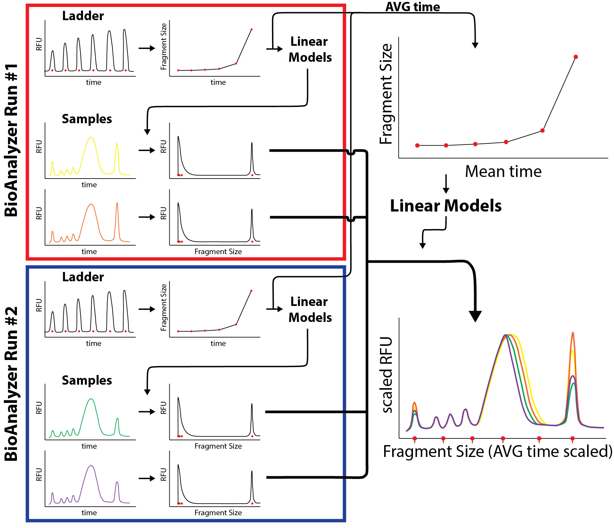

# FA_traces

Plots Fragment Analyzer electrophoresis traces (RFU vs. migration time) generated by 
LC-Hi-C nuclei pre-digestion.

`plot_Bioanalyzer_traces.R` reads exported ladder ("Size Calibration") and sample
files, builds piecewise-linear calibration models to convert migration time to
fragment size (and back), min/max-normalizes RFU and migration time to the lower
and upper marker peaks so runs are comparable, and writes one overlaid trace PDF
per condition comparison (e.g. DMSO vs. TPL/DRB, RNase inhibitor vs. RNase A,
dTAG conditions, heat shock).



**Requires:** R with `tidyverse`, `stringr`, `RColorBrewer`, `paletteer`.

## Input data

The ladder and sample traces are hosted on Zenodo. Download
and unzip the two archives so that a `ladders/` and a `samples/` folder sit
together in one data directory:

```bash
curl -L --fail -o ladders.zip \
  "https://zenodo.org/records/22101214/files/ladders.zip?download=1"
curl -L --fail -o samples.zip \
  "https://zenodo.org/records/22101214/files/samples.zip?download=1"
```

Then point the `data_folder` variable at the top of `plot_Bioanalyzer_traces.R`
at the directory holding the unzipped `ladders/` and `samples/` folders. Output
PDF paths are likewise hard-coded and should be edited before rerunning.
